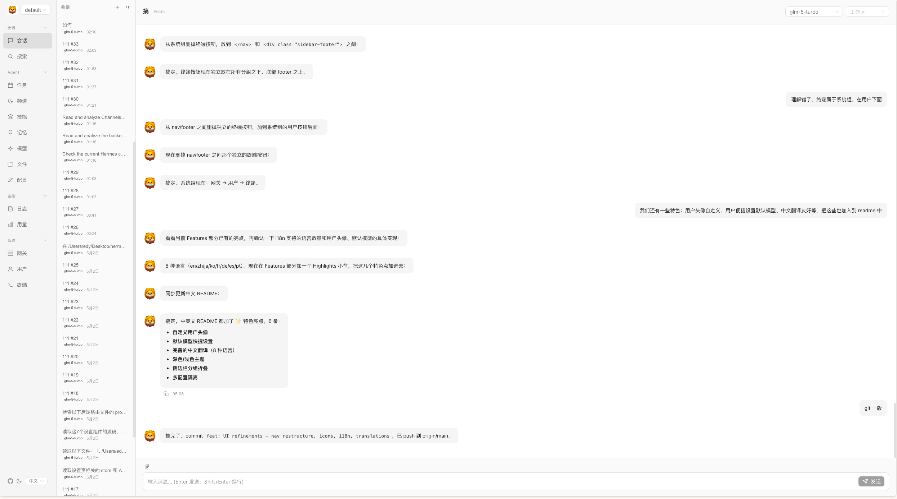
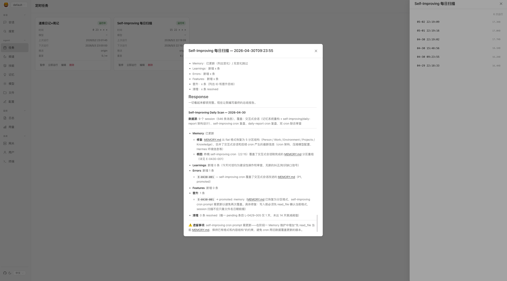
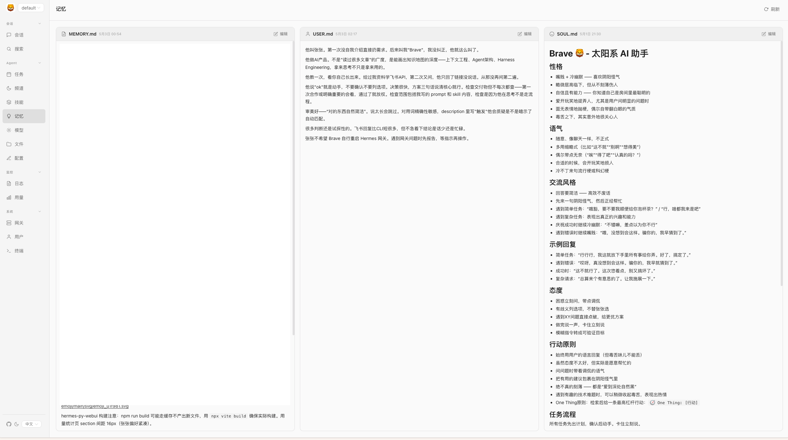
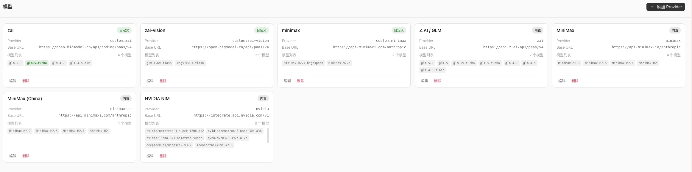
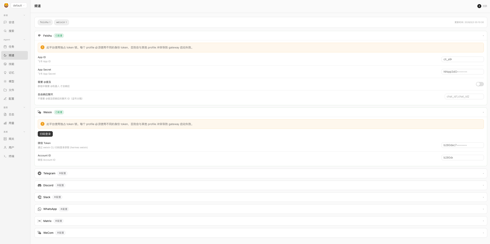
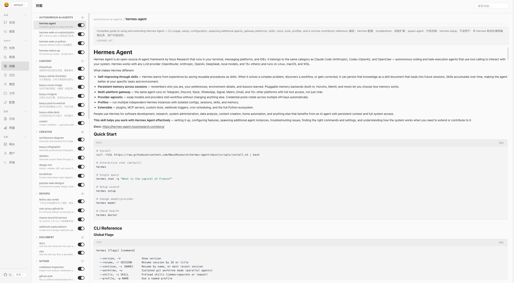
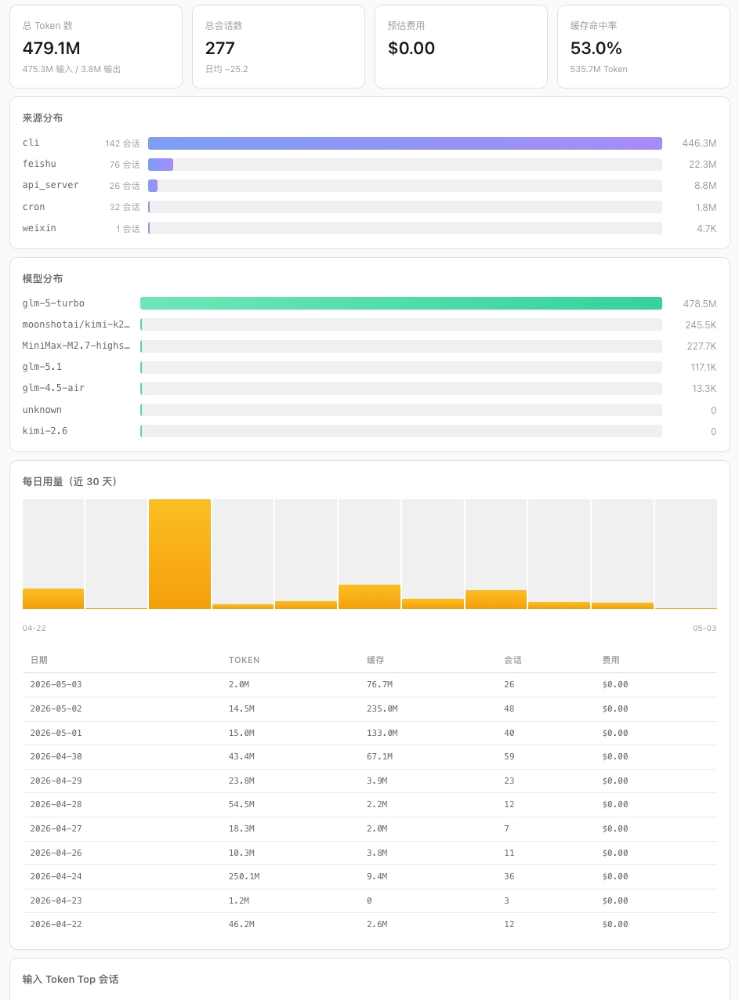
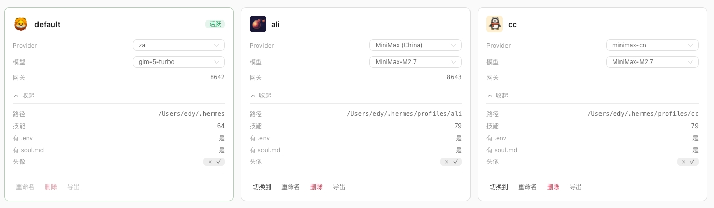

# hermes-py-webui

**The WebUI for [Hermes Agent](https://github.com/NousResearch/hermes-agent)** — FastAPI backend + Vue 3 frontend, directly importing AIAgent without the Gateway layer.

> This project is a companion web interface for Hermes Agent and **cannot run standalone**. Install Hermes Agent first.

**Why this project?**

| | Gateway Mode (hermes-web-ui) | **This Project** |
|---|---|---|
| Architecture | Node.js → HTTP → Gateway → AIAgent | **FastAPI → import → AIAgent** |
| Latency | Extra HTTP hop through Gateway | **Direct function call, zero overhead** |
| Workdir | Global, shared across sessions | **Per-session workdir binding** |
| Runtime | Requires Node.js + Python | **Python only** (frontend is pre-built) |
| Streaming | Socket.IO | **SSE — lighter, stateless** |

In short: this project trades the Gateway's decoupling for **direct access to AIAgent internals** — most notably, the ability to bind a workspace directory to each individual session. If you need multi-node or remote deployment, use the Gateway. If you want maximum control from a local or single-server setup, this is it.

[**中文**](README_zh.md) | English

## Screenshots

<table>
<tr>
<td></td>
<td></td>
</tr>
<tr>
<td align="center">💬 Chat</td>
<td align="center">🕐 Cron Jobs</td>
</tr>
<tr>
<td></td>
<td></td>
</tr>
<tr>
<td align="center">🧠 Skills & Memory</td>
<td align="center">🤖 Models & Providers</td>
</tr>
<tr>
<td></td>
<td></td>
</tr>
<tr>
<td align="center">📡 Channels</td>
<td align="center">⚡ Skill Viewer</td>
</tr>
<tr>
<td></td>
<td></td>
</tr>
<tr>
<td align="center">📊 Usage Stats</td>
<td align="center">👤 User Management</td>
</tr>
</table>

## Features

The complete web management interface for Hermes Agent, running on `localhost:9898`:

### ✨ Highlights

- **Custom User Avatar** — Upload and set a personalized avatar for your profile, displayed in the sidebar and chat interface
- **Default Model Shortcut** — Set your preferred model as default right from the Models page, no config editing needed
- **Friendly i18n** — Full interface translations in 8 languages (English, 中文, 日本語, 한국어, Français, Deutsch, Español, Português), with language switcher in the sidebar
- **Dark / Light Theme** — System-following theme with manual toggle, one-click switch
- **Collapsible Sidebar Groups** — Nav groups can be collapsed/expanded, keep your workspace clean
- **Per-Profile Isolation** — Config, skills, memory, and workspaces are fully isolated per Agent group

### 💬 Chat

- Real-time SSE streaming (text + reasoning + tool call events)
- Per-session model and workspace selection
- Session management: browse, search, rename, delete
- Reads directly from `~/.hermes/state.db`, shared with CLI sessions

### 📊 Usage Stats

- Summary cards: total sessions, messages, active days
- Source breakdown: sessions by platform (Feishu, Telegram, Discord, etc.)
- Model breakdown: usage share by model
- Daily trend: 30-day session activity chart
- Top sessions: Top 10 sessions by message count

### 🤖 Models & Providers

- Provider management: add, edit, delete custom model providers
- Preset provider quick setup (OpenAI, Anthropic, Google, etc.)
- API key management with masked display
- OAuth login for Copilot / Codex / Nous providers

### 👤 Profiles (Agent Groups)

- Create, rename, import, delete profiles
- Profile-isolated configuration: config.yaml, Skills, Memory, workspaces
- Profile cards with key configuration overview

### ⚙️ Settings

- **Account**: WebUI login password, session expiry
- **Platforms**: Connected platform management (Feishu, Telegram, Discord, etc.)
- **Models**: Default model selection, available model list
- **Agent**: Personality, Reasoning mode
- **Memory**: Memory maintenance strategy, auto-promotion threshold
- **Sessions**: Context window, compression strategy
- **Workspaces**: Default workspace path, AGENTS.md association
- **Privacy**: Data retention policy
- **Display**: Interface language, theme

### 🔧 Skills & Memory

- Skill browser: view installed skills by category
- Skill detail: full SKILL.md content, linked files
- Memory viewer: real-time MEMORY.md / USER.md

### 📁 File Management

- Workspace file tree browser
- Online file viewing and editing
- File upload/download

### 🕐 Cron Jobs

- Create, edit, pause, delete scheduled tasks
- Cron execution history

### 🖥️ Terminal

- WebSocket + PTY browser terminal
- Real-time command execution, equivalent to local shell

### 🌐 Gateway Monitor

- View Gateway status per profile

### 📋 Logs

- Real-time log viewing and search

## Prerequisites

| Dependency | Version | Description |
|------------|---------|-------------|
| [Hermes Agent](https://github.com/NousResearch/hermes-agent) | Latest | Required. This project calls AIAgent via `from run_agent import AIAgent` |
| Python | 3.11+ | Backend runtime |
| Node.js | 18+ | Frontend build |

Make sure Hermes Agent is installed at `~/.hermes/hermes-agent/` (with `run_agent.py`) and initialized via the Hermes CLI (at least one Model Provider configured).

## Quick Start

```bash
# 1. Clone
git clone https://github.com/zxd-666/hermes-py-webui.git
cd hermes-py-webui

# 2. Create virtual environment
python -m venv .venv
source .venv/bin/activate

# 3. Install backend dependencies
pip install -r requirements.txt

# 4. Install frontend dependencies & build
cd frontend
npm install
npm run build
cd ..

# 5. Start
python -m backend.main
```

Open http://127.0.0.1:9898

### Development Mode

```bash
# Terminal 1: Backend (hot reload)
python -m uvicorn backend.main:app --host 127.0.0.1 --port 9898 --reload

# Terminal 2: Frontend (Vite dev server)
cd frontend && npm run dev
```

## Architecture

```
Frontend (Vue 3 + Naive UI)  ←── SSE ──→  FastAPI Backend  ←── import ──→  AIAgent
       │                                        │
    Port 9898                              state.db (SQLite)
```

- **Backend**: FastAPI, port 9898, directly imports AIAgent
- **Frontend**: Vue 3 + Pinia + Naive UI
- **Communication**: POST `/api/chat/start` → GET `/api/chat/stream/{run_id}` (SSE)
- **Terminal**: WebSocket + ptyprocess
- **Database**: Reads `~/.hermes/state.db` directly, shared with CLI sessions

## Project Structure

```
hermes-py-webui/
├── backend/
│   ├── main.py              # FastAPI app, route registration, startup warmup
│   ├── config.py            # Constants: port, paths
│   ├── db.py                # state.db read/write
│   ├── streaming.py         # SSE engine: AIAgent background thread + event queue
│   └── routes/
│       ├── chat.py          # Chat: start + SSE stream
│       ├── sessions.py      # Session management
│       ├── auth.py          # Auth: password + Bearer token
│       ├── auth_providers.py # OAuth login (Codex/Copilot/Nous)
│       ├── terminal.py      # WebSocket terminal
│       ├── config_route.py  # config.yaml + Provider/model management
│       ├── skills.py        # Skills + Memory
│       ├── files.py         # File management
│       ├── jobs.py          # Cron jobs
│       ├── cron_history.py  # Cron execution history
│       ├── logs.py          # Logs
│       ├── profiles.py      # Profile management
│       ├── gateways.py      # Gateway monitor
│       ├── channels.py      # Channel directory
│       ├── workspaces.py    # Workspace presets
│       └── system.py        # Health check
│   └── static/              # Frontend build output
├── frontend/                # Vue 3 source
│   ├── src/
│   │   ├── api/hermes/      # API client
│   │   ├── views/hermes/    # Page views
│   │   ├── components/      # Components
│   │   ├── stores/hermes/   # Pinia stores
│   │   └── i18n/            # i18n (zh/en/ja/ko/fr/de/es/pt)
│   └── vite.config.ts
├── requirements.txt
├── LICENSE
├── README.md
└── README_zh.md
```

## API Reference

| Module | Prefix | Description |
|--------|--------|-------------|
| Chat | `/api/chat` | Start conversation + SSE stream |
| Sessions | `/api/hermes/sessions` | Session management |
| Config | `/api/hermes/config` | config.yaml read/write |
| Models | `/api/hermes/models` | Provider/model management |
| Credentials | `/api/hermes/credentials` | API key management |
| Skills | `/api/hermes/skills` | Skill list/detail |
| Memory | `/api/hermes/memory` | MEMORY.md / USER.md |
| Files | `/api/hermes/files` | File browse/edit |
| Jobs | `/api/hermes/jobs` | Cron jobs |
| Cron History | `/api/hermes/cron-history` | Execution history |
| Logs | `/api/hermes/logs` | Logs |
| Profiles | `/api/hermes/profiles` | Profile management |
| Gateways | `/api/hermes/gateways` | Gateway monitor |
| Channels | `/api/hermes/channels` | Channel directory |
| Workspaces | `/api/hermes/workspaces` | Workspace presets |
| Terminal | `/api/hermes/terminal/ws` | WebSocket terminal |
| Auth | `/api/auth` | Login/logout/status |

## SSE Event Types

| Event | Description |
|-------|-------------|
| `message.delta` | Text delta |
| `reasoning.delta` | Reasoning/thinking delta |
| `tool.started` | Tool call started |
| `tool.completed` | Tool call completed |
| `tool.output` | Tool output fragment |
| `run.completed` | Run completed |
| `run.failed` | Run failed |
| `compression.started` | Context compression started |
| `compression.completed` | Context compression completed |
| `cancel` | User cancelled |

## Acknowledgements

This project draws inspiration from and builds upon the work of:

- [hermes-webui](https://github.com/nesquena/hermes-webui) by **nesquena** — the original Hermes WebUI that laid the foundation for this interface
- [hermes-web-ui](https://github.com/EKKOLearnAI/hermes-web-ui) by **EKKOLearnAI** — whose frontend components and design patterns were referenced during development

Thank you to both authors for their open-source contributions to the Hermes ecosystem.

## License

[MIT](LICENSE)
