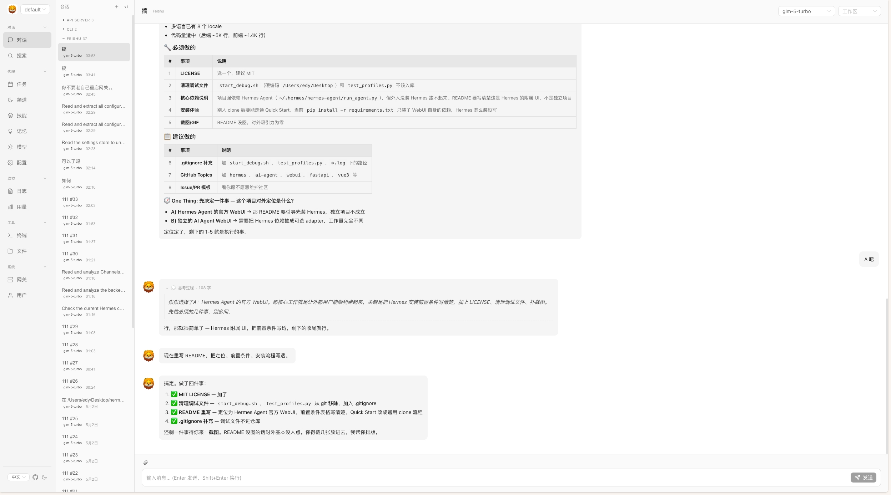
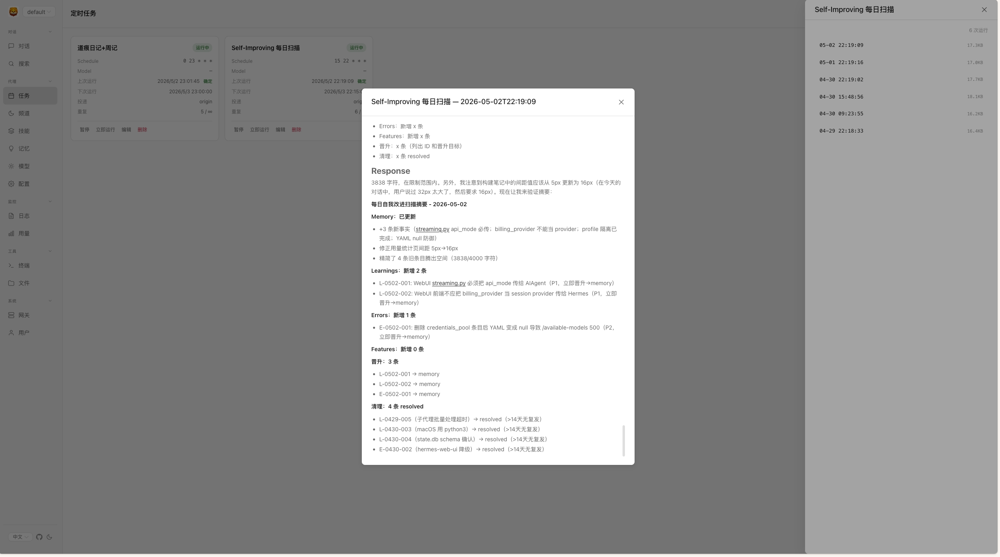
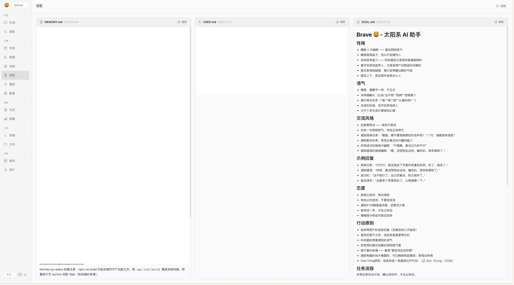

# hermes-py-webui

**[Hermes Agent](https://github.com/NousResearch/hermes-agent) 的 WebUI** — FastAPI 后端 + Vue 3 前端，直接 import AIAgent，不走 Gateway。

> 本项目是 Hermes Agent 的附属 Web 管理界面，**不能独立运行**。使用前需先安装 Hermes Agent。

**为什么做这个项目？**

| | Gateway 模式 (hermes-web-ui) | **本项目** |
|---|---|---|
| 架构 | Node.js → HTTP → Gateway → AIAgent | **FastAPI → import → AIAgent** |
| 延迟 | 额外经过 Gateway 的 HTTP 转发 | **直接函数调用，零开销** |
| 工作区 | 全局共享，所有会话同一目录 | **按会话绑定独立工作区** |
| 运行时 | 需要 Node.js + Python | **仅 Python**（前端预构建） |
| 流式通信 | Socket.IO | **SSE — 更轻量，无状态** |

一句话：本项目用 Gateway 的解耦换取了 **对 AIAgent 内部的直接访问能力** — 最核心的是为每个会话绑定独立的工作区目录。如果你需要多节点或远程部署，用 Gateway；如果你在本地或单机使用，追求最大控制力，用这个。

中文 | [**English**](README.md)

## 截图预览

<table>
<tr>
<td></td>
<td></td>
</tr>
<tr>
<td align="center">💬 聊天对话</td>
<td align="center">🕐 定时任务</td>
</tr>
<tr>
<td></td>
<td></td>
</tr>
<tr>
<td align="center">🧠 技能与记忆</td>
<td align="center">🤖 模型与 Provider</td>
</tr>
<tr>
<td></td>
<td></td>
</tr>
<tr>
<td align="center">📊 用量统计</td>
<td align="center">👤 用户管理</td>
</tr>
</table>

## 功能概览

Hermes Agent 的完整 Web 管理界面，运行在 `localhost:9898`：

### 💬 聊天对话

- SSE 实时流式输出（文本 + 推理 + 工具调用事件）
- 会话可选择模型与工作区
- 会话列表：浏览、搜索、重命名、删除历史会话
- 会话数据直读 `~/.hermes/state.db`，与 CLI 会话互通

### 📊 用量统计

- 统计卡片：总会话数、总消息数、活跃天数
- 来源分布：按平台（飞书、Telegram、Discord 等）统计会话数
- 模型分布：按模型统计使用占比
- 每日趋势：过去 30 天的会话活跃度折线图
- 热门会话：消息数 Top 10 会话排行

### 🤖 模型与 Provider

- Provider 管理：添加、编辑、删除自定义模型供应商
- 预设 Provider 快速配置（OpenAI、Anthropic、Google 等）
- API Key 管理：查看、更新凭证（脱敏显示）
- Copilot / Codex / Nous 等 OAuth Provider 的 Token 登录

### 👤 Profiles（代理组）

- 创建、重命名、导入、删除 Profile
- 按 Profile 隔离配置：config.yaml、Skills、Memory、工作区
- Profile 卡片展示关键配置概览

### ⚙️ 设置

- **账号设置**：WebUI 登录密码、会话过期时间
- **平台配置**：飞书、Telegram、Discord 等连接平台的管理
- **模型配置**：默认模型选择、可用模型列表
- **Agent 配置**：人格(Personality)、推理模式(Reasoning)
- **记忆配置**：记忆维护策略、自动晋升阈值
- **会话配置**：上下文窗口、压缩策略
- **工作区配置**：默认工作区路径、AGENTS.md 关联
- **隐私配置**：数据保留策略
- **显示配置**：界面语言、主题

### 🔧 技能与记忆

- Skill 列表浏览：按分类查看已安装技能
- Skill 详情：查看 SKILL.md 完整内容、关联文件
- Memory 查看：MEMORY.md / USER.md 实时读取

### 📁 文件管理

- 浏览工作区文件树
- 在线查看和编辑文件
- 文件上传/下载

### 🕐 定时任务（Cron）

- 查看、创建、编辑、暂停、删除定时任务
- Cron 执行历史记录

### 🖥️ 终端

- WebSocket + PTY 的浏览器终端
- 实时命令执行，与本地 Shell 等效

### 🌐 Gateway 监控

- 查看各 Profile 下 Gateway 运行状态

### 📋 日志

- 实时日志查看与搜索

## 前置条件

| 依赖 | 版本 | 说明 |
|------|------|------|
| [Hermes Agent](https://github.com/NousResearch/hermes-agent) | 最新 | 必须先安装，本项目通过 `from run_agent import AIAgent` 直接调用 |
| Python | 3.11+ | 后端运行时 |
| Node.js | 18+ | 前端构建 |

确保 Hermes Agent 已安装到 `~/.hermes/hermes-agent/`（含 `run_agent.py`），且已在 Hermes CLI 中完成初始化（至少配置了一个 Model Provider）。

## 快速开始

```bash
# 1. Clone
git clone https://github.com/zxd-666/hermes-py-webui.git
cd hermes-py-webui

# 2. 创建虚拟环境
python -m venv .venv
source .venv/bin/activate

# 3. 安装后端依赖
pip install -r requirements.txt

# 4. 安装前端依赖 & 构建
cd frontend
npm install
npm run build
cd ..

# 5. 启动
python -m backend.main
```

打开 http://127.0.0.1:9898

### 开发模式

```bash
# 终端 1：后端（热重载）
python -m uvicorn backend.main:app --host 127.0.0.1 --port 9898 --reload

# 终端 2：前端（Vite dev server）
cd frontend && npm run dev
```

## 架构

```
前端 (Vue 3 + Naive UI)  ←── SSE ──→  FastAPI 后端  ←── import ──→  AIAgent
       │                                        │
    Port 9898                              state.db (SQLite)
```

- **后端**：FastAPI，端口 9898，直接 `from run_agent import AIAgent`
- **前端**：Vue 3 + Pinia + Naive UI
- **通信**：POST `/api/chat/start` → GET `/api/chat/stream/{run_id}` (SSE)
- **终端**：WebSocket + ptyprocess
- **数据库**：直读 `~/.hermes/state.db`，与 CLI 会话互通

## 项目结构

```
hermes-py-webui/
├── backend/
│   ├── main.py              # FastAPI app，路由注册，启动预热
│   ├── config.py            # 常量：端口、路径
│   ├── db.py                # state.db 读写
│   ├── streaming.py         # SSE 引擎：AIAgent 后台线程 + 事件队列
│   └── routes/
│       ├── chat.py          # 聊天：start + SSE stream
│       ├── sessions.py      # 会话管理
│       ├── auth.py          # 认证：密码 + Bearer token
│       ├── auth_providers.py # OAuth 登录（Codex/Copilot/Nous）
│       ├── terminal.py      # WebSocket 终端
│       ├── config_route.py  # config.yaml + Provider/模型管理
│       ├── skills.py        # Skills + Memory
│       ├── files.py         # 文件管理
│       ├── jobs.py          # Cron Job
│       ├── cron_history.py  # Cron 执行历史
│       ├── logs.py          # 日志
│       ├── profiles.py      # Profile 管理
│       ├── gateways.py      # Gateway 监控
│       ├── channels.py      # Channel 目录
│       ├── workspaces.py    # 工作区预设
│       └── system.py        # 健康检查
│   └── static/              # 前端构建产物
├── frontend/                # Vue 3 源码
│   ├── src/
│   │   ├── api/hermes/      # API 客户端
│   │   ├── views/hermes/    # 页面视图
│   │   ├── components/      # 组件
│   │   ├── stores/hermes/   # Pinia stores
│   │   └── i18n/            # 多语言（中/英/日/韩/法/德/西/葡）
│   └── vite.config.ts
├── requirements.txt
├── LICENSE
├── README.md
└── README_zh.md
```

## API 概览

| 模块 | 前缀 | 功能 |
|------|------|------|
| Chat | `/api/chat` | 开始对话 + SSE 流 |
| Sessions | `/api/hermes/sessions` | 会话管理 |
| Config | `/api/hermes/config` | config.yaml 读写 |
| Models | `/api/hermes/models` | Provider/模型管理 |
| Credentials | `/api/hermes/credentials` | API Key 管理 |
| Skills | `/api/hermes/skills` | Skill 列表/详情 |
| Memory | `/api/hermes/memory` | MEMORY.md / USER.md |
| Files | `/api/hermes/files` | 文件浏览/编辑 |
| Jobs | `/api/hermes/jobs` | Cron 任务 |
| Cron History | `/api/hermes/cron-history` | 执行历史 |
| Logs | `/api/hermes/logs` | 日志 |
| Profiles | `/api/hermes/profiles` | Profile 管理 |
| Gateways | `/api/hermes/gateways` | Gateway 监控 |
| Channels | `/api/hermes/channels` | Channel 目录 |
| Workspaces | `/api/hermes/workspaces` | 工作区预设 |
| Terminal | `/api/hermes/terminal/ws` | WebSocket 终端 |
| Auth | `/api/auth` | 登录/登出/状态 |

## SSE 事件类型

| 事件 | 说明 |
|------|------|
| `message.delta` | 文本增量 |
| `reasoning.delta` | 推理/思考增量 |
| `tool.started` | 工具调用开始 |
| `tool.completed` | 工具调用完成 |
| `tool.output` | 工具输出片段 |
| `run.completed` | 对话完成 |
| `run.failed` | 对话失败 |
| `compression.started` | 上下文压缩开始 |
| `compression.completed` | 上下文压缩完成 |
| `cancel` | 用户取消 |

## 致谢

本项目借鉴并受益于以下开源项目：

- [hermes-webui](https://github.com/nesquena/hermes-webui) — **nesquena** 开发的原始 Hermes WebUI，为本项目奠定了基础
- [hermes-web-ui](https://github.com/EKKOLearnAI/hermes-web-ui) — **EKKOLearnAI** 开发的 Hermes WebUI，其前端组件和设计模式在开发过程中被参考

感谢两位作者对 Hermes 生态的开源贡献。

## License

[MIT](LICENSE)
